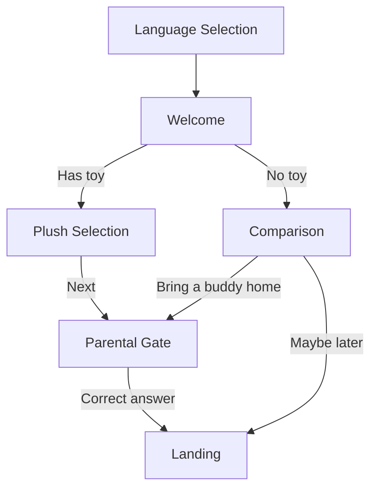

# Architecture Notes

## Product Flow

## Folder Responsibilities

| Folder | Purpose |
|--------|---------|
| `components/common` | Presentational UI building blocks |
| `screens` | Route-level containers wiring navigation + translations |
| `hooks` | Stateful logic extracted from screens |
| `theme` | Single source of truth for visual tokens |
| `localization` | i18n bootstrap and locale resources |
| `constants` | Static domain data (routes, plush catalog, comparison matrix) |
| `utils` | Pure helper functions |
| `types` | Shared TypeScript contracts |
| `navigation` | Navigator composition |

## Localization Strategy

1. All user-facing strings live in JSON resource files.
2. Screens consume copy exclusively through `t('key')`.
3. Polski selection switches i18n language to `pl`.
4. A post-processor appends `*` for the `pl` locale, satisfying the assignment requirement while keeping English base text.

This mirrors production patterns where QA can verify locale activation without maintaining fully translated copy during early builds.

## Responsive Strategy

- **Phone portrait**: stacked vertical layout
- **Phone landscape**: constrained action widths, shorter hero
- **Tablet**: multi-column card layouts, centered content with max width
- **Scaling**: moderate scale based on 375pt reference width

## Navigation Strategy

- Typed `RootStackParamList` for compile-time route safety
- `ROUTES` constants prevent magic strings
- `replace` after language confirm and parental gate success to prevent returning to gated screens
- `reset` when changing language from landing

## Parental Gate

- Generates addition, subtraction, or multiplication expressions
- Validates numeric input only
- Locks out after 3 failed attempts and regenerates question
- Disabled submit until input is non-empty

## Accessibility

- Buttons expose `accessibilityRole` and labels
- Language/plush cards use radio semantics
- Error messages use `accessibilityLiveRegion`
- Font scaling enabled on typography components
- Minimum 48dp touch targets on buttons

## Performance

- Memoized callbacks in screens
- Pure utility functions for gate generation
- Image assets bundled locally (no network dependency)
- No unnecessary global state — local screen state + navigation params

## Scalability

The feature-first layout supports adding:

- New locales by adding JSON + language option
- New plush SKUs via `PLUSH_OPTIONS`
- Additional onboarding steps as stack screens
- Redux/Context later if cross-screen state grows beyond navigation params

## Testing Readiness

- Unit tests for pure utils and i18n behavior
- Jest preset configured for React Native 0.86
- Components accept `testID` props for future E2E
